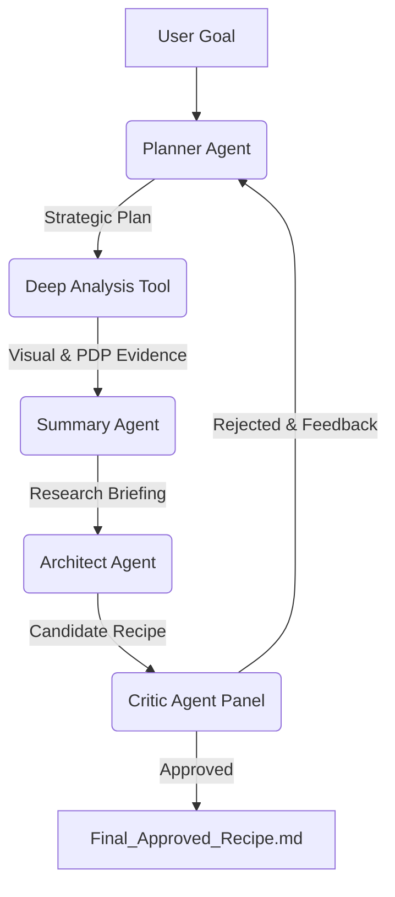

<div align="center">

# BEACON: aBductive Extrapolation under Anchored CONstraints

**A Neuro-Symbolic Multi-Agent Framework for Autonomous Materials Discovery under Data-Scarce Conditions**

[](https://opensource.org/licenses/MIT)
[](https://www.python.org/downloads/)

[🇨🇳 中文版](./README_ZH.md) | [🇬🇧 English](./README.md)

</div>

---

## 📑 Table of Contents
- [📖 Introduction](#-introduction)
- [🌟 Key Features](#-key-features)
- [⚙️ System Architecture & Workflow](#-system-architecture--workflow)
- [🚀 Getting Started](#-getting-started)
- [📂 Project Structure](#-project-structure)
- [🧪 Test Suite](#-test-suite)
- [📜 License](#-license)

---

## 📖 Introduction
**BEACON** (**aBductive Extrapolation under Anchored CONstraints**) is a neuro-symbolic multi-agent framework designed to bridge the semantic gap between statistical machine learning (ML) models and logical materials design. Integrating small-data ML models as a priori generative bounding functions (anchors) with Large Language Models (LLMs) executing target-conditioned symbolic reasoning, BEACON couples statistical anchoring with logical extrapolation to navigate and explore out-of-distribution (OOD) chemical spaces.

As a proof-of-concept application, this repository contains the complete implementation of BEACON applied to the inverse design of **near-infrared-emissive carbon dots (NIR-CDs) with Long Persistent Luminescence (LPL)**. Working within a data-scarce regime (n = 624), the framework successfully derived a nitrogen-free, boron-matrix rigidification strategy, leading to the synthesis of a composite with NIR emission centered at ~739 nm and a lifetime of 0.78 ms, demonstrating target-conditioned extrapolation far beyond the distribution limits of the training set.

---

## 🌟 Key Features

### 1. Multi-Agent Cognitive Architecture
The system is composed of five specialized agents, each mirroring a role in a human research team:
- **Planner Agent**: Acts as the *Lead Scientist*. It breaks down user requests, queries experimental databases, and formulates high-level design strategies based on global feature importance (SHAP).
- **Deep Analysis Tool**: Acts as the *Data Analyst*. It performs quantitative validation using Partial Dependence Plots (PDP) and decodes abstract "Fingerprint Bits" into visual chemical substructures.
- **Summary Agent**: Acts as the *Research Assistant*. It synthesizes vast amounts of data, charts, and chemical structures into a coherent research briefing.
- **Architect Agent**: Acts as the *Senior Engineer*. It converts theoretical strategies into actionable **Standard Operating Procedures (SOPs)**, identifying specific precursor candidates and synthesis parameters (Temperature, Time, Ratios).
- **Critic Agent**: Acts as the *Review Board*. A panel of LLM judges evaluates proposed recipes against physical laws and project goals, enforcing a strict quality control loop.

### 2. Explainable AI & Visual Reasoning
Unlike traditional inverse design models that output raw vectors, our system prioritizes **Explainability**:
- **Mechanism Transparency**: It explains *why* a specific precursor is chosen (e.g., "The pyridine ring contributes to n-pi* transitions...").
- **Visual Evidence**: It generates and interprets chemical structure images (SVG/PNG) and PDP charts, allowing human users to verify the AI's logic.

### 3. Closed-Loop Self-Correction
The system features a **Cumulative Failure Memory**. If a design fails the Critic's review:
- The specific reasons for rejection are recorded.
- The system enters a new iteration cycle.
- The Planner is explicitly warned about past failures to prevent repetitive errors, ensuring rapid convergence on high-quality solutions.

### 4. Resume-State Loading
The system incorporates an advanced native checkpointing recovery mechanism. In the event of an API rate limit, network interruption, or required manual intervention, there is no need to restart from scratch:
- Use `--resume-dir` and `--resume-iter` to load historical rejected recipes and detailed Critic reviews directly from a previous run directory.
- It automatically reconstitutes the collective memory stack across all agents, seamlessly continuing the closed-loop optimization from the exact iteration where it left off.

---

## ⚙️ System Architecture & Workflow

The autonomous discovery process is driven by `test_runner.py` and follows a strict 5-step logic:



### Step 1: Strategic Planning (Planner Agent)
- **Input**: User's natural language goal (e.g., "Design a red-emitting LPL material with emission > 700 nm").
- **Process**:
  1.  **Semantic Parsing**: Understands the target property (Emission vs. Lifetime).
  2.  **Data Retrieval**: Queries the internal experimental database (`analyze_material_data`) to ground findings in historical data.
  3.  **Global Analysis**: Retrieves SHAP (Shapley Additive Explanations) summary plots to identify the top 20 most critical features (Bits & Conditions).
- **Output**: A strategic JSON plan outlining design constraints, critical chemical motifs to explore, and target parameters.

### Step 2: Deep Verification (Deep Analysis Tool)
- **Input**: The strategic plan with identified "Key Bits".
- **Process**:
  1.  **PDP Generation**: Plots Partial Dependence Plots for key features to determine the precise correlation (positive/negative) between the feature and the target property.
  2.  **Structure Decoding**: Uses RDKit to reverse-engineer abstract Morgan Fingerprint bits back into human-readable chemical substructures (e.g., identifying "Bit_1024" as a "Pyrazine ring").
  3.  **Visualization**: Renders these substructures as SVG/PNG images.
- **Output**: A set of quantitative charts and chemical structure images saved to the `Deep_Analysis` directory.

### Step 3: Information Synthesis (Summary Agent)
- **Input**: Planner's context, Deep Analysis visual evidence, and (if applicable) rejection feedback from previous rounds.
- **Process**:
  1.  **Evidence Aggregation**: Reads all generated charts and images.
  2.  **Context Construction**: Combines quantitative data with qualitative chemical rules.
  3.  **Visual Interpretation**: "Reads" the molecular images to describe specific functional groups in natural language.
- **Output**: A comprehensive `summary_report.json` that serves as the "Research Briefing."

### Step 4: Recipe Generation (Architect Agent)
- **Input**: The Research Briefing.
- **Process**:
  1.  **Scout Function**: Searches the 120M+ molecule database (`data/CID-SMILES`) for commercially available precursors that contain the required chemical substructures.
  2.  **Parameter Optimization**: Uses the `Optimizer` module to determine the optimal synthesis conditions (Temperature, Time, Mass Ratios) based on the Planner's constraints.
  3.  **SOP Writing**: Drafts a detailed, step-by-step experiment recipe (Materials, Equipment, Procedure).
- **Output**: A candidate experimental recipe (Markdown format).

### Step 5: Peer Review (Critic Agent)
- **Input**: The candidate recipe and the original user goal.
- **Process**:
  1.  **Panel Review**: Multiple LLM instances (judges) independently evaluate the recipe.
  2.  **Criteria Check**: Checks for logic errors (e.g., "Did it use a negative-correlated feature to increase the target?"), feasibility, and alignment with user goals.
  3.  **Voting**: Calculates a pass rate.
- **Decision**:
  - **Pass (>8.5/10)**: The recipe is approved and saved as `Final_Approved_Recipe.md`.
  - **Reject**: The system loops back. The feedback is added to `Cumulative Failure History`, and the Planner starts **Step 1** again with updated constraints.

---

## 🚀 Getting Started

### Prerequisites
- **Python 3.8+**
- **LLM API Access**: OpenAI (GPT-4) or Google (Gemini) API keys.
- **Chemical Libraries**: RDKit.

### Installation
1. Clone the repository:
   ```bash
   git clone https://github.com/YourRepo/BEACON-Materials-Discovery.git
   cd BEACON-Materials-Discovery
   ```
2. Install dependencies:
   ```bash
   pip install -r requirements.txt
   ```
   *Note: If you have issues installing `rdkit` via pip, we recommend using Conda: `conda install -c conda-forge rdkit`.*

3. Configure Environment Credentials:
   - Copy the template credentials:
     ```bash
     cp config/secrets.env.template config/secrets.env
     ```
   - Open `config/secrets.env` and fill in your actual API keys:
     ```env
     OPENAI_API_KEY=sk-your-openai-api-key
     GEMINI_API_KEY=AIzaSy-your-gemini-key
     ```
   *(Note: `config/secrets.env` is ignored by Git, ensuring your credentials are never pushed to GitHub).*

4. Set Up the Large Database (`data/CID-SMILES`):
   - The molecule scout searches through a large database file of 120M+ molecules named `data/CID-SMILES` (~8.75 GB). Due to its size, this file is excluded from Git.
   - **How to construct this file**: Create a tab-separated TSV file (without header) containing two columns: `PubChem CID` and `SMILES` representation.
   - **For quick testing**: You can skip acquiring the full database and run mock tests directly (see [Test Suite](#-test-suite) below).

### Running the System
To initiate the autonomous discovery loop:
```bash
python test_runner.py
```
- The system will create a unique directory in `experiments/` (e.g., `experiments/2026-05-20_20-00-00/`).
- Logs, intermediate plots, cost breakdowns, and the final approved recipe will be saved there.

**Command Line Arguments**:
- `--query` / `-q`: Natural language goal (default is designed red-emitting long persistent luminescence material).
- `--config` / `-c`: Run mode config (`full`, `no_summary`, `no_scout`, `ablation_all`, `model_ablation`).
- `--max-iter` / `-m`: Limit the maximum iterations for the closed loop.
- `--resume-dir` and `--resume-iter`: Seamlessly resume an interrupted run.

**Resuming a Previous Interrupted Run:**
```bash
python test_runner.py --resume-dir "experiments/2026-05-20_15-30-22" --resume-iter 3
```

---

## 📂 Project Structure

```text
BEACON-Materials-Discovery/
├── config/
│   ├── config.yaml          # LLM Model & Path Configs
│   ├── prompts.yaml         # Agent System Prompts
│   ├── secrets.env          # API Credentials (ignored by Git)
│   └── secrets.env.template # Template for API credentials
├── data/
│   ├── EM_feature_importance.csv      # Material features (SHAP)
│   ├── EM_shap_summary_plot.png       # Global correlation plot
│   ├── Life_feature_importance.csv    # Lifetime features (SHAP)
│   ├── Life_shap_summary_plot.png     # Global correlation plot
│   ├── SMILES_建模数据.xlsx            # Source molecular training data
│   ├── Total_data_em.xlsx             # Complete training dataset (Emission)
│   ├── Total_data_life.xlsx           # Complete training dataset (Lifetime)
│   ├── em_feature_names.json          # Pre-computed feature columns
│   ├── em_scaler.pkl                  # Fitted model scaler
│   ├── life_feature_names.json         # Pre-computed feature columns
│   ├── life_scaler.pkl                # Fitted model scaler
│   ├── trained_em_model.pkl           # Pre-trained ML model (Emission)
│   ├── trained_life_model.pkl         # Pre-trained ML model (Lifetime)
│   └── 碳点数据收集.xlsx                # Historical experiments database
├── src/                     # Source Package
│   ├── llm_agents/          # Core Agent Modules
│   │   ├── __init__.py
│   │   ├── architect.py     # SOP Recipe Composer
│   │   ├── critic.py        # Consensus Peer Review
│   │   ├── data_tools.py    # Database & SHAP interface
│   │   ├── deep_analysis_tool.py # XAI & PDP Calculator
│   │   ├── optimizer.py     # Synthesis conditions optimizer
│   │   ├── planner.py       # Global Lead Scientist planning
│   │   ├── scout.py         # Substructure database query
│   │   └── summary.py       # Briefing synthesizer & vision interpreter
│   ├── __init__.py
│   ├── llm_client.py        # Robust backoff client & token cost tracker
│   └── utils.py             # ConfigLoader & global thread-safe logging
├── tests/                   # Testing Suite
│   ├── test_critic.py       # Diagnostic script for checking LLM Reviewers
│   ├── test_optimizer.py    # Automated mock optimization testing
│   ├── test_rdkit.py        # Verification for RDKit dependencies
│   ├── test_scout_mock.py   # Large-scale search test using mock dataset
│   └── test_svg_to_png.py   # Test suite for visual headless browser rendering
├── .gitignore               # Exclude temporary, cache and large files
├── requirements.txt         # Project package requirements
└── test_runner.py           # Main execution orchestrator
```

---

## 🧪 Test Suite

We provide a comprehensive diagnostic suite inside the `tests/` folder. These tests can run entirely locally without external API charges or downloading the 8.75 GB full chemistry database:

1. **Verify Molecular Search & Density Plotting**:
   ```bash
   python tests/test_scout_mock.py
   ```
   *Creates a temporary mock database on-the-fly, executes structural mapping, and generates PCA/KDE chemistry space maps.*

2. **Verify 3D Surface optimization & ML predictions**:
   ```bash
   python tests/test_optimizer.py
   ```
   *Generates synthetic models to ensure chemical feature calculation, normalization scaling, and grid search optimization are working properly.*

3. **Verify Chem-rendering (Headless Browser Fallback)**:
   ```bash
   python tests/test_svg_to_png.py
   ```
   *Validates that high-resolution vector molecule maps can be transformed successfully into clean png matrices.*

---

## 📜 License
This project is licensed under the MIT License. See [LICENSE](LICENSE) for details.
