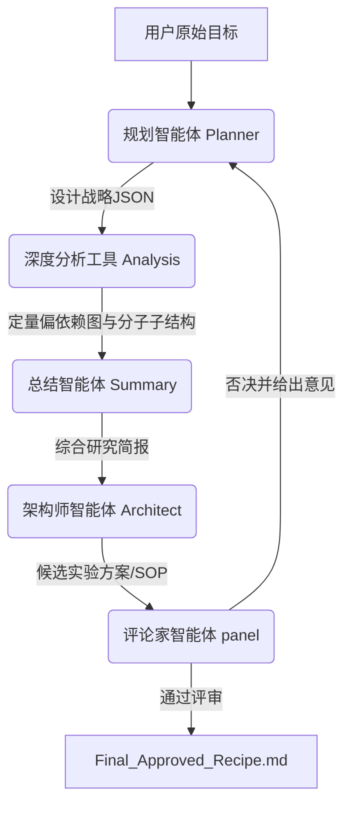

<div align="center">

# BEACON: aBductive Extrapolation under Anchored CONstraints

**基于“统计锚定–逻辑外推”双向机制的神经符号多智能体自主材料发现框架**

[](https://opensource.org/licenses/MIT)
[](https://www.python.org/downloads/)

[🇨🇳 中文版](./README_ZH.md) | [🇬🇧 English](./README.md)

</div>

---

## 📑 目录
- [📖 项目简介](#-项目简介)
- [🌟 核心特性](#-核心特性)
- [⚙️ 系统架构与运行逻辑](#-系统架构与运行逻辑)
- [🚀 快速开始](#-快速开始)
- [📂 项目目录结构](#-项目目录结构)
- [🧪 核心测试套件](#-核心测试套件)
- [📜 许可证](#-许可证)

---

## 📖 项目简介
**BEACON** (**aBductive Extrapolation under Anchored CONstraints**，基于锚定约束的反绎外推) 是一种创新的神经符号多智能体自主材料发现框架。它旨在将传统的机器学习（ML）小数据预测模型从终点转变为生成边界函数（即“生成笼”），与大语言模型（LLMs）进行深度融合，实现**“统计锚定与逻辑外推”**的双向协同，从而有效解决科学探索中数据稀疏、黑盒模型语义鸿沟以及外推泛化失效的瓶颈。

作为概念验证，本仓库提供了 BEACON 框架在**近红外发射/长余辉碳点基复合材料（NIR-CDs / LPL-CDs）**自主逆向设计中的完整实现。在极度匮乏的实验数据集（仅包含 624 个样本）约束下，BEACON 成功自主推导出一套“无氮引入、硼基固性基质结合”的全新逆向设计策略，成功合成出荧光峰值在 ~739 nm 且余辉寿命长达 0.78 ms 的新型发光材料，实现了跨越式的数据分布外（OOD）反绎外推发现。

---

## 🌟 核心特性

### 1. 多智能体认知架构 (Multi-Agent Cognitive Architecture)
系统由五个各司其职的专业智能体组成，完美复刻了一个顶尖科研团队的协作模式：
- **规划智能体 (Planner Agent)**：担任“首席科学家”。它负责解析用户需求，拆解任务，并通过查询实验数据库和全局特征重要性 (SHAP) 来制定顶层设计战略。
- **深度分析工具 (Deep Analysis Tool)**：担任“数据分析师”。它负责执行定量验证，生成偏依赖图 (PDP)，并将抽象的“指纹位 (Bits)”解码为人类可读的化学子结构图像。
- **总结智能体 (Summary Agent)**：担任“科研助理”。它将分散的数据、图表和化学结构信息汇总成一份逻辑严密的“研究简报”。
- **架构师智能体 (Architect Agent)**：担任“高级工程师”。它将理论战略转化为可落地的 **标准实验操作流程 (SOP)**，精确定位前驱体候选物并在参数空间中搜索最佳合成条件（温度、时间、配比）。
- **评论家智能体 (Critic Agent)**：担任“评审委员会”。由多个大模型“评委”组成的专家组，依据物理学规律和项目目标对方案进行严格打分和审查，把控方案质量。

### 2. 可解释性与视觉推理 (Explainable AI & Visual Reasoning)
不同于输出生硬数值向量的传统逆向设计模型，本系统高度重视 **可解释性**：
- **机理透明化**：系统能够解释 *为什么* 选择某个特定前驱体（例如：“吡啶环有助于促进 n-pi* 跃迁...”）。
- **视觉证据链**：自动生成并分析 PDP 趋势图和化学结构图像 (SVG/PNG)，让科研人员能够直观验证 AI 的推理逻辑。

### 3. 闭环自纠正机制 (Closed-Loop Self-Correction)
系统内置了 **“累计失败记忆 (Cumulative Failure Memory)”** 机制。如果生成的方案未能通过 Critic 的评审：
- 具体的拒绝理由会被详细记录。
- 系统自动进入下一轮迭代循环。
- Planner 会收到关于过往失败教训的明确警示，从而避免重复错误，确保系统能够快速收敛至高质量的解决方案。

### 4. 状态断点续传 (Resume-State Loading)
系统内置了完善的历史状态快照提取机制。当执行遭遇 API 速率限制、网络波动或需要人工介入时，无需从头开始浪费算力与 Token：
- 支持通过 `--resume-dir` 和 `--resume-iter` 命令行参数，直接读取指定历史运行目录中被拒的配方详情与评委点评。
- 自动原地重建多智能体的知识记忆堆栈，从中断的迭代轮次完美无缝开启下一轮闭环优化。

---

## ⚙️ 系统架构与运行逻辑

自主发现流程由 `test_runner.py` 驱动，严格遵循以下 5 步闭环逻辑：



### Step 1: 战略规划 (Planner Agent)
- **输入**：用户的自然语言指令（例如：“帮我设计一种发射波长 > 700 nm 的红光长余辉材料”）。
- **处理过程**：
  1.  **语义解析**：理解目标性质（发射波长 vs 余辉寿命）。
  2.  **数据检索**：调用 `analyze_material_data` 工具查询内部实验数据库，获取历史数据作为锚点。
  3.  **全局分析**：获取 SHAP 摘要图，识别对目标性质影响最大的 Top 20 关键特征（化学基团与工艺条件）。
- **输出**：一份包含设计约束、关键化学基团和目标参数范围的战略规划 JSON。

### Step 2: 深度验证 (Deep Analysis Tool)
- **输入**：战略规划中确定的“关键指纹位 (Key Bits)”。
- **处理过程**：
  1.  **PDP 生成**：绘制偏依赖图 (Partial Dependence Plots)，定量分析特征值变化对性能的正/负向影响。
  2.  **结构解码**：利用 RDKit 将抽象的 Morgan Fingerprint 指纹位反向解析为具体的化学子结构（如识别 "Bit_1024" 为 "吡嗪环"）。
  3.  **可视化渲染**：将这些子结构渲染为 SVG/PNG 格式的图像。
- **输出**：保存至 `Deep_Analysis` 目录的一系列定量图表和分子结构图。

### Step 3: 情报汇总 (Summary Agent)
- **输入**：Planner 的战略上下文、Deep Analysis 的视觉证据，以及（如果有的话）前几轮的评审反馈。
- **处理过程**：
  1.  **证据聚合**：读取所有生成的图表和图像文件。
  2.  **语境构建**：将定量数据与化学领域知识相结合。
  3.  **视觉解读**：利用多模态能力“阅读”分子结构图，用自然语言描述其中的官能团特征。
- **输出**：一份详尽的 `summary_report.json`，即“研究简报”。

### Step 4: 方案生成 (Architect Agent)
- **输入**：研究简报。
- **处理过程**：
  1.  **分子侦察 (Scout)**：在 1.2 亿分子的数据库 (`data/CID-SMILES`) 中搜索包含目标子结构且市售可得的前驱体。
  2.  **参数优化 (Optimizer)**：基于约束条件，计算最佳的合成工艺参数（温度、时间、质量比）。
  3.  **SOP 撰写**：起草详细的、分步骤的实验操作方案（试剂、仪器、步骤、后处理）。
- **输出**：一份 Markdown 格式的候选实验方案。

### Step 5: 同行评审 (Critic Agent)
- **输入**：候选方案 与 用户原始目标。
- **处理过程**：
  1.  **专家组评审**：多个 LLM 实例（评委）独立对方案进行评估。
  2.  **规则检查**：检查是否存在逻辑谬误（如：“是否错误地使用了负相关特征来提升目标值？”）、可行性以及是否偏离用户初衷。
  3.  **投票决策**：计算通过率。
- **决策分支**：
  - **通过 (>8.5/10)**：方案被批准并保存为 `Final_Approved_Recipe.md`，流程结束。
  - **拒绝**：系统回滚。反馈意见被写入 `Cumulative Failure History`，Planner 携带修正后的约束条件重新开始 **Step 1**。

---

## 🚀 快速开始

### 环境依赖
- **Python 3.8+**
- **LLM API**: 需要 OpenAI (GPT-4) 或 Google (Gemini) 的 API 访问权限。
- **化学库**: RDKit.

### 安装步骤
1. 克隆代码仓库：
   ```bash
   git clone https://github.com/YourRepo/BEACON-Materials-Discovery.git
   cd BEACON-Materials-Discovery
   ```
2. 安装 Python 依赖：
   ```bash
   pip install -r requirements.txt
   ```
   *注意：如果通过 pip 安装 `rdkit` 遇到平台兼容性问题，推荐使用 Conda 安装：`conda install -c conda-forge rdkit`。*

3. 配置环境凭证：
   - 复制凭证模板：
     ```bash
     cp config/secrets.env.template config/secrets.env
     ```
   - 打开 `config/secrets.env` 并填入您的真实 API Key：
     ```env
     OPENAI_API_KEY=sk-your-openai-key
     GEMINI_API_KEY=AIzaSy-your-gemini-key
     ```
   *(注意：`config/secrets.env` 已自动加入 `.gitignore` 忽略列表，您的真实密钥绝不会被提交到 GitHub 上)*。

4. 设置大型分子数据库 (`data/CID-SMILES`):
   - 系统的 Scout 搜索引擎使用一个包含 1.2 亿多分子的大型数据库文件 `data/CID-SMILES`（约 8.75 GB）。由于文件大小限制，它已被 Git 忽略。
   - **如何构建此文件**：该文件应为一个无表头的、以 Tab 分隔的 TSV 文件，包含两列：`PubChem CID` 和 `SMILES` 结构简式。
   - **快速测试通道**：如果您只是想测试代码逻辑，无需获取这个 8.75 GB 的大型文件，可直接运行 [核心测试套件](#-核心测试套件) 下的 Mock 测试。

### 运行系统
启动自主发现主循环：
```bash
python test_runner.py
```
- 系统将在 `experiments/` 目录下创建一个以当前时间命名的运行子文件夹（例如 `experiments/2026-05-20_20-00-00/`）。
- 所有的运行日志、中间偏依赖图 (PDP)、多维分析图标、成本报告和最终通过的方案都将保存在该文件夹中。

**命令行运行参数**：
- `--query` / `-q`: 传入用户的自然语言自定义设计需求。
- `--config` / `-c`: 运行的特定管道配置（可选项：`full`, `no_summary`, `no_scout`, `ablation_all`, `model_ablation`）。
- `--max-iter` / `-m`: 限制大闭环的最大迭代优化次数。
- `--resume-dir` 和 `--resume-iter`: 提供中断续接所需的参数。

**中断状态接力续传示例**：
```bash
python test_runner.py --resume-dir "experiments/2026-05-20_15-30-22" --resume-iter 3
```

---

## 📂 项目目录结构

```text
BEACON-Materials-Discovery/
├── config/
│   ├── config.yaml          # LLM 模型与路径配置文件
│   ├── prompts.yaml         # 各智能体核心 System Prompts
│   ├── secrets.env          # API 真实凭证环境文件 (Git自动忽略)
│   └── secrets.env.template # API 凭证配置模板文件
├── data/
│   ├── EM_feature_importance.csv      # 荧光峰值特征重要性数据 (SHAP)
│   ├── EM_shap_summary_plot.png       # 荧光峰值全局特征相关图
│   ├── Life_feature_importance.csv    # 余辉寿命特征重要性数据 (SHAP)
│   ├── Life_shap_summary_plot.png     # 余辉寿命全局特征相关图
│   ├── SMILES_建模数据.xlsx            # 建模分子源数据
│   ├── Total_data_em.xlsx             # 荧光完整训练数据集 (Emission)
│   ├── Total_data_life.xlsx           # 寿命完整训练数据集 (Lifetime)
│   ├── em_feature_names.json          # 预计算荧光特征列名
│   ├── em_scaler.pkl                  # 训练适配的荧光归一化器
│   ├── life_feature_names.json         # 预计算寿命特征列名
│   ├── life_scaler.pkl                # 训练适配的寿命归一化器
│   ├── trained_em_model.pkl           # 训练成熟的荧光强度 XGBoost 模型
│   ├── trained_life_model.pkl         # 训练成熟的余辉寿命 XGBoost 模型
│   └── 碳点数据收集.xlsx                # 历史实验数据库 (锚点大表)
├── src/                     # 源代码核心包
│   ├── llm_agents/          # 核心智能体模块
│   │   ├── __init__.py
│   │   ├── architect.py     # 方案架构设计智能体 (配方SOP编排)
│   │   ├── critic.py        # 评审委员会智能体 (共识投票审查)
│   │   ├── data_tools.py    # 数据解析与 SHAP 检索接口
│   │   ├── deep_analysis_tool.py # XAI 深度定量分析与偏依赖图绘制
│   │   ├── optimizer.py     # 工艺参数寻优引擎
│   │   ├── planner.py       # 首席科学家决策智能体 (战略设计)
│   │   ├── scout.py         # 高性能多进程分子检索搜索引擎
│   │   └── summary.py       # 科研助理智能体 (报告合成与分子图像阅读)
│   ├── __init__.py
│   ├── llm_client.py        # 具备指数退避的 LLM 通信工厂及 Cost 计算器
│   └── utils.py             # 配置管理及线程安全的全局日志记录器
├── tests/                   # 核心诊断测试集
│   ├── test_critic.py       # 交互式单独测试评委模型连通性脚本
│   ├── test_optimizer.py    # 自动化验证 3D 工艺表面拟合与参数寻优
│   ├── test_rdkit.py        # 验证本地 RDKit 化学组件是否正常安装
│   ├── test_scout_mock.py   # 自动化测试并行分子检索、PCA及KDE密度图绘制
│   └── test_svg_to_png.py   # 自动化验证分子高分辨率矢量图截图渲染
├── .gitignore               # 忽略本地临时文件、大数据库及密钥
├── requirements.txt         # 声明 Python 库依赖项列表
└── test_runner.py           # 统一主程序总控制入口
```

---

## 🧪 核心测试套件

我们为开发者在 `tests/` 文件夹下准备了非常详实的核心功能诊断工具，这些测试可以在**没有任何外部 API 费用**且**不需要下载 8.75 GB 分子数据库**的情况下在本地纯手工跑通：

1. **一键测试并行分子检索与化学空间演化路径绘制**：
   ```bash
   python tests/test_scout_mock.py
   ```
   *该脚本会自动在内存中构造 5000+ 的 Mock 分子数据库，并一键调起多进程算力完成匹配、提取背景指纹做 Morgan fingerprint 计算，完成主成分 (PCA) 和核密度估计 (KDE) 并输出 Nature 级别高分辨率化学空间轨迹图。*

2. **一键测试 3D 反应表面优化与模型推理**：
   ```bash
   python tests/test_optimizer.py
   ```
   *验证特征映射、Scaler 归一化缩放以及优化器对工艺反应表面进行网格参数搜索等底层预测的准确性。*

3. **一键测试分子矢量图向高分辨率图片转化 (Headless 浏览器渲染)**：
   ```bash
   python tests/test_svg_to_png.py
   ```
   *验证系统在缺失系统转换组件时，能否利用内置 Edge/Chrome headless 引擎，自动后台将分子结构 SVG 高保真转换为 PNG 矩阵。*

---

## 📜 许可证
本项目采用 MIT 许可证。详情请参阅 [LICENSE](LICENSE) 文件。
